# Laporan Resmi Praktikum Sistem Operasi Modul 4

## Identitas
- Nama: Nazwa Aulia Dwi Purnomo
- NRP: 5027251018
- Kelas: B
- Kode Asisten: KENZ

---

## Struktur Repository

Struktur repository yang digunakan pada soal ini adalah sebagai berikut:

```bash
SISOP-4-2026-IT-018
└── soal_1
    └── kenz_rescue.c
````

File utama pada soal ini adalah `kenz_rescue.c` dimana ia berfungsi sebagai program FUSE yang akan melakukan mount folder `amba_files` ke folder `mnt`.

---

## Soal 1 - Save Asisten Kenz
### Penjelasan Soal

Pada soal 1, Sebastian diminta untuk membantu Asisten Kenz menemukan lokasi ritual dari catatan-catatan ekspedisi Mas Amba. Catatan tersebut tersimpan dalam sebuah arsip yang setelah diekstrak akan menghasilkan folder `amba_files/`. Di dalam folder tersebut terdapat tujuh file, yaitu `1.txt` sampai `7.txt`. <br>

Setiap file berisi potongan cerita ekspedisi dan salah satu baris penting yang diawali dengan prefix `KOORD:`. Potongan koordinat tersebut harus dibaca secara berurutan dari `1.txt` sampai `7.txt`, lalu digabungkan untuk mendapatkan lokasi tujuan Mas Amba. <br>

Selain itu, soal juga minta untuk membuat program FUSE bernama `kenz_rescue.c`. Program ini harus menerima dua argumen, yaitu `source_directory` dan `mount_directory`. Folder source berisi file asli, sedangkan folder mount akan menjadi cerminan dari folder source. Jadi, file `1.txt` sampai `7.txt` yang ada di `amba_files/` juga harus bisa dibaca dari folder `mnt/`.<br>

Tidak hanya itu, program juga harus nambah satu file virtual bernama `tujuan.txt` pada root mount directory. File ini tidak boleh benar-benar dibuat di folder `amba_files/`, tapi harus muncul saat pengguna membuka folder `mnt/`. Isi `tujuan.txt` harus dibuat secara langsung saat file tersebut dibaca, yaitu dari gabungan fragmen `KOORD:` yang ada pada tujuh file catatan.

---

### Penyelesaian Soal

#### a. Ambil arsip Amba Files dari 'flashdisk'

Pada bagian ini, soal minta agar arsip dari flashdisk diekstrak terlebih dahulu. Hasil akhirnya harus berupa folder `amba_files/` yang berisi file `1.txt` sampai `7.txt`. Setelah proses unzip selesai, file zip wajib dihapus agar tidak tersisa di working directory.

Sebelum mengambil arsip, folder `soal_1` hanya berisi file program utama, yaitu `kenz_rescue.c`.

Setelah itu, program dikompilasi terlebih dahulu agar menghasilkan executable `kenz_rescue`.

```bash
gcc -Wall `pkg-config fuse --cflags` kenz_rescue.c -o kenz_rescue `pkg-config fuse --libs`
```

Command tersebut digunakan untuk melakukan compile program C dengan library FUSE. Opsi `-Wall` digunakan agar warning dari compiler bisa terlihat. Bagian `pkg-config fuse --cflags` dan `pkg-config fuse --libs` digunakan untuk mengambil konfigurasi header dan library FUSE yang dibutuhkan saat compile.

Setelah compile berhasil, struktur folder menjadi:
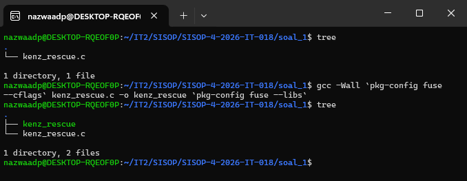

Kemudian dibuat folder `mnt` sebagai mount directory.

```bash
mkdir mnt
```
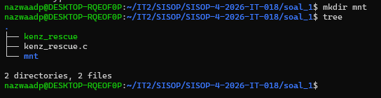

Setelah itu, arsip `amba_files.zip` diunduh menggunakan `gdown`.

```bash
gdown "https://drive.google.com/file/d/1nLXFhptDo2mnULZsw8pTwyAVpV49W20U/view?usp=drive_link" -O amba_files.zip
```
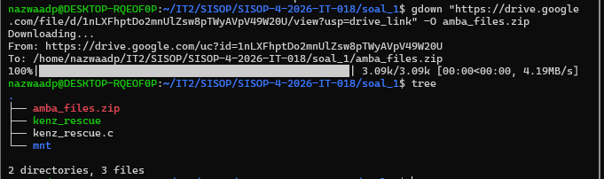

File tersebut kemudian diekstrak menggunakan command:

```bash
unzip amba_files.zip
```
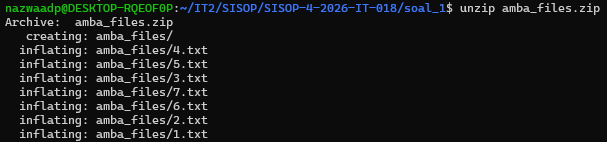

Setelah proses unzip selesai, muncul folder `amba_files/` yang berisi tujuh file catatan.

```bash
tree
```

Output foldernya menjadi:


Karena pada soal disebutkan bahwa file zip harus dihapus setelah unzip, maka file `amba_files.zip` dihapus dengan command:

```bash
rm amba_files.zip
```

Setelah dihapus, struktur akhir working directory menjadi:


Dengan begitu, poin ini sudah terpenuhi karena arsip berhasil diekstrak menjadi folder `amba_files/`, isi file lengkap dari `1.txt` sampai `7.txt`, dan file zip sudah tidak tersisa di working directory.

---

#### b. Membuat program FUSE `kenz_rescue.c`

Pada bagian ini, soal minta untuk membuat program FUSE bernama `kenz_rescue.c`. Program ini menerima dua argumen, yaitu:

```bash
<source_directory> <mount_directory>
```

Pada pengerjaan ini, `amba_files` digunakan sebagai source directory, sedangkan `mnt` digunakan sebagai mount directory.

Program dijalankan dengan command:

```bash
./kenz_rescue amba_files -f mnt
```

Opsi `-f` digunakan agar FUSE berjalan di foreground. Dengan begitu, proses mount tetap terlihat di terminal dan lebih mudah dipantau saat pengujian.

Di dalam kode, program menggunakan FUSE versi 28.

```c
#define FUSE_USE_VERSION 28
```

Program juga menyimpan lokasi folder asli pada variabel global `source_dir`.

```c
static char source_dir[1024];
```

Variabel ini digunakan untuk menyimpan path dari folder `amba_files`. Karena semua file asli tetap berada di folder tersebut, setiap operasi file yang dilakukan dari mount directory nantinya akan diarahkan ke folder source.

Agar program tetap bisa menemukan folder source dengan benar, pada fungsi `main()` digunakan `realpath()`.

```c
realpath(argv[1], source_dir);
```

Dengan `realpath()`, path dari `amba_files` disimpan dalam bentuk absolute path. Jadi, meskipun FUSE bekerja dari mount directory, program tetap tahu lokasi file asli yang harus dibaca.

Program juga memiliki fungsi bantu bernama `make_full_path()`.

```c
static void make_full_path(char *fullpath, const char *path) {
    snprintf(fullpath, 1024, "%s%s", source_dir, path);
}
```

Fungsi ini digunakan untuk menggabungkan `source_dir` dengan path dari FUSE. Misalnya, jika `source_dir` adalah folder `amba_files` dan FUSE minta path `/1.txt`, maka fungsi ini akan menghasilkan path lengkap menuju file asli `amba_files/1.txt`.

Agar FUSE dapat bekerja sebagai filesystem, program mendaftarkan beberapa operasi utama ke dalam `struct fuse_operations`.

```c
static struct fuse_operations kenz_oper = {
    .getattr = kenz_getattr,
    .readdir = kenz_readdir,
    .open = kenz_open,
    .read = kenz_read,
};
```

Operasi yang digunakan adalah `getattr`, `readdir`, `open`, dan `read`.

##### Fungsi `getattr`

Fungsi `kenz_getattr()` digunakan ketika sistem membutuhkan informasi mengenai file atau folder. Contohnya saat pengguna menjalankan `ls`, `ls -l`, atau `stat`.

```c
static int kenz_getattr(const char *path, struct stat *stbuf) {
    int res;
    char fullpath[1024];

    memset(stbuf, 0, sizeof(struct stat));
```

Pada awal fungsi, isi `stbuf` dikosongkan terlebih dahulu menggunakan `memset()` agar tidak ada data lama yang ikut terbaca.

Untuk file biasa seperti `1.txt` sampai `7.txt`, atribut file diambil langsung dari file asli di `amba_files/`.

```c
make_full_path(fullpath, path);

res = lstat(fullpath, stbuf);
if (res == -1) {
    return -errno;
}
```

Dengan cara ini, file yang tampil di `mnt/` tetap memiliki atribut sesuai file aslinya.

##### Fungsi `readdir`

Fungsi `kenz_readdir()` digunakan ketika pengguna menjalankan `ls` pada mount directory.

```c
static int kenz_readdir(const char *path, void *buf, fuse_fill_dir_t filler,
                        off_t offset, struct fuse_file_info *fi) {
```

Fungsi ini membuka folder asli yang sesuai dengan path pada mount directory.

```c
make_full_path(fullpath, path);

dp = opendir(fullpath);
if (dp == NULL) {
    return -errno;
}
```

Kemudian seluruh isi folder source dimasukkan ke hasil tampilan mount menggunakan `filler()`.

```c
while ((de = readdir(dp)) != NULL) {
    struct stat st;

    memset(&st, 0, sizeof(st));
    st.st_ino = de->d_ino;
    st.st_mode = de->d_type << 12;

    if (filler(buf, de->d_name, &st, 0)) {
        break;
    }
}
```

Bagian ini membuat file `1.txt` sampai `7.txt` dari `amba_files/` juga muncul di folder `mnt/`.

##### Fungsi `open`

Fungsi `kenz_open()` digunakan ketika file akan dibuka, misalnya saat menjalankan:

```bash
cat mnt/1.txt
```

Untuk file biasa, program membuka file asli dari source directory.

```c
make_full_path(fullpath, path);

fd = open(fullpath, fi->flags);
if (fd == -1) {
    return -errno;
}

close(fd);
return 0;
```

Pada bagian ini, file hanya dicek apakah bisa dibuka atau tidak. Setelah itu file ditutup kembali, karena pembacaan isi file dilakukan pada fungsi `read`.

##### Fungsi `read`

Fungsi `kenz_read()` digunakan ketika isi file benar-benar dibaca.

```c
static int kenz_read(const char *path, char *buf, size_t size, off_t offset,
                     struct fuse_file_info *fi) {
```

Untuk file biasa, program membuka file asli dari `amba_files/`, lalu membacanya menggunakan `pread()`.

```c
make_full_path(fullpath, path);

fd = open(fullpath, O_RDONLY);
if (fd == -1) {
    return -errno;
}

res = pread(fd, buf, size, offset);
if (res == -1) {
    res = -errno;
}

close(fd);
return res;
```

`pread()` digunakan agar pembacaan file dapat dilakukan berdasarkan offset tertentu. Ini sesuai dengan cara kerja filesystem, karena file tidak selalu dibaca sekaligus dari awal sampai akhir.

Setelah FUSE dijalankan, isi folder `mnt/` dicek menggunakan:

```bash
ls -v mnt
```

Output yang muncul adalah:

```bash
1.txt 2.txt 3.txt 4.txt 5.txt 6.txt 7.txt tujuan.txt
```

Kemudian dilakukan pengecekan isi file `1.txt` pada mount directory dan source directory.

```bash
cat mnt/1.txt
cat amba_files/1.txt
```

Kedua output tersebut sama, sehingga dapat disimpulkan bahwa file pada mount directory berhasil menjadi cerminan dari file asli.

Untuk memastikan semua file `1.txt` sampai `7.txt` benar-benar identik, digunakan command:

```bash
for i in 1 2 3 4 5 6 7; do
    diff mnt/$i.txt amba_files/$i.txt && echo "$i.txt OK"
done
```

Output yang didapatkan adalah:

```bash
1.txt OK
2.txt OK
3.txt OK
4.txt OK
5.txt OK
6.txt OK
7.txt OK
```

Output tersebut menunjukkan bahwa seluruh file dari `1.txt` sampai `7.txt` berhasil dibaca dari mount directory dan isinya sama persis dengan source directory.

Dengan begitu, poin ini sudah terpenuhi karena program FUSE berhasil dibuat, menerima argumen source dan mount directory, serta mendukung operasi `getattr`, `readdir`, `open`, dan `read`.

---

#### c. Menambahkan file virtual `tujuan.txt` di root mount directory

Pada bagian ini, soal minta agar program menambahkan satu file virtual bernama `tujuan.txt` pada root mount directory. File ini harus muncul saat pengguna menjalankan `ls mnt/`, tapi tidak boleh ada secara fisik di folder `amba_files/`.

File virtual ini ditambahkan pada fungsi `kenz_readdir()`.

```c
if (strcmp(path, "/") == 0) {
    filler(buf, "tujuan.txt", NULL, 0);
}
```

Bagian tersebut berarti `tujuan.txt` hanya ditambahkan ketika path yang sedang dibuka adalah root mount directory, yaitu `/`. Jadi, saat pengguna menjalankan:

```bash
ls -v mnt
```

maka `tujuan.txt` akan ikut muncul bersama file `1.txt` sampai `7.txt`.

Output yang didapatkan adalah:

```bash
1.txt 2.txt 3.txt 4.txt 5.txt 6.txt 7.txt tujuan.txt
```

Namun, file `tujuan.txt` tidak dibuat di folder `amba_files/`. Folder `amba_files/` tetap hanya berisi tujuh file asli.

```bash
ls -v amba_files/
```

Output yang diharapkan adalah:

```bash
1.txt 2.txt 3.txt 4.txt 5.txt 6.txt 7.txt
```

Hal ini menunjukkan bahwa `tujuan.txt` memang file virtual dari FUSE, bukan file asli yang disimpan di source directory.

Agar `tujuan.txt` dapat dikenali sebagai file oleh sistem, atributnya juga dibuat secara manual di fungsi `kenz_getattr()`.

```c
if (strcmp(path, "/tujuan.txt") == 0) {
    char content[4096];

    build_tujuan_content(content, sizeof(content));

    stbuf->st_mode = S_IFREG | 0444;
    stbuf->st_nlink = 1;
    stbuf->st_size = strlen(content);

    return 0;
}
```

Pada bagian ini, jika path yang diminta adalah `/tujuan.txt`, maka program tidak mengambil atribut dari file asli. Program langsung membuat atribut file secara manual.

```c
stbuf->st_mode = S_IFREG | 0444;
```

Bagian tersebut menunjukkan bahwa `tujuan.txt` adalah regular file dengan permission read-only. Permission `0444` berarti file hanya bisa dibaca dan tidak bisa ditulis.

Kemudian jumlah link file diatur menjadi 1.

```c
stbuf->st_nlink = 1;
```

Ukuran file diatur berdasarkan panjang isi yang dihasilkan oleh fungsi `build_tujuan_content()`.

```c
stbuf->st_size = strlen(content);
```

Dengan cara ini, saat pengguna menjalankan:

```bash
stat mnt/tujuan.txt
```

file `tujuan.txt` tetap memiliki ukuran yang konsisten dengan isi yang akan ditampilkan saat dibaca.

Pada fungsi `kenz_open()`, file `tujuan.txt` juga diperlakukan khusus.

```c
if (strcmp(path, "/tujuan.txt") == 0) {
    return 0;
}
```

Karena `tujuan.txt` tidak ada secara fisik di `amba_files/`, maka program tidak perlu membuka file asli. Program cukup mengembalikan `0` agar FUSE tahu bahwa file berhasil dibuka.

Dengan begitu, poin ini sudah terpenuhi karena `tujuan.txt` berhasil muncul di `mnt/`, tapi tidak benar-benar dibuat di `amba_files/`.

---

#### d. Menemukan koordinat ritual

Pada bagian ini, soal minta agar isi `tujuan.txt` dibuat secara langsung saat file tersebut dibaca. Isi file tidak boleh disiapkan dulu atau disimpan di disk. Program harus membaca file `1.txt` sampai `7.txt`, mengambil baris yang diawali prefix `KOORD:`, lalu menggabungkan fragmennya secara berurutan.

Bagian utama yang menangani proses ini adalah fungsi `build_tujuan_content()`.

```c
static void build_tujuan_content(char *result, size_t result_size) {
    char combined[2048] = "";
    char filepath[2048];
    char line[2048];
```

Variabel `combined` digunakan untuk menyimpan gabungan semua fragmen koordinat. Variabel `filepath` digunakan untuk menyimpan path file yang sedang dibaca, sedangkan `line` digunakan untuk membaca isi file per baris.

Karena soal minta fragmen dibaca dari `1.txt` sampai `7.txt`, program menggunakan loop dari 1 sampai 7.

```c
for (int i = 1; i <= 7; i++) {
    snprintf(filepath, sizeof(filepath), "%s/%d.txt", source_dir, i);
```

Pada setiap iterasi, program membuat path menuju file asli di folder `amba_files/`.

Setelah itu file dibuka menggunakan `fopen()`.

```c
FILE *fp = fopen(filepath, "r");

if (fp == NULL) {
    continue;
}
```

Jika file gagal dibuka, program akan melewati file tersebut agar program tidak langsung berhenti.

Kemudian file dibaca baris per baris menggunakan `fgets()`.

```c
while (fgets(line, sizeof(line), fp) != NULL) {
```

Setiap baris dicek apakah diawali dengan prefix `KOORD:`.

```c
if (strncmp(line, "KOORD:", 6) == 0) {
```

Jika baris tersebut diawali dengan `KOORD:`, maka program mengambil isi setelah prefix tersebut.

```c
char *fragment = line + 6;
```

Karena setelah `KOORD:` bisa saja ada spasi atau tab, program membersihkannya terlebih dahulu.

```c
while (*fragment == ' ' || *fragment == '\t') {
    fragment++;
}
```

Lalu karakter newline di akhir baris dihapus agar hasil gabungan tidak terpotong baris.

```c
fragment[strcspn(fragment, "\r\n")] = '\0';
```

Setelah fragmen bersih, fragmen tersebut digabungkan ke variabel `combined`.

```c
strncat(combined, fragment, sizeof(combined) - strlen(combined) - 1);
```

Karena setiap file hanya membutuhkan satu baris `KOORD:`, setelah fragmen ditemukan program langsung keluar dari loop pembacaan file tersebut.

```c
break;
```

Setelah semua file dari `1.txt` sampai `7.txt` selesai dibaca, hasil akhirnya dimasukkan ke format output yang diminta.

```c
snprintf(result, result_size, "Tujuan Mas Amba: %s\n", combined);
```

Dengan demikian, isi `tujuan.txt` akan berbentuk:

```bash
Tujuan Mas Amba: <gabungan_fragmen>
```

File `tujuan.txt` dibuat secara on-the-fly pada fungsi `kenz_read()`.

```c
if (strcmp(path, "/tujuan.txt") == 0) {
    char content[4096];

    build_tujuan_content(content, sizeof(content));

    size_t len = strlen(content);
```

Saat pengguna menjalankan:

```bash
cat mnt/tujuan.txt
```

program akan memanggil `build_tujuan_content()` terlebih dahulu. Jadi, isi `tujuan.txt` benar-benar dibuat saat dibutuhkan, bukan disimpan sebagai file asli.

Setelah isi dibuat, program mengecek offset pembacaan.

```c
if (offset >= len) {
    return 0;
}
```

Jika offset sudah melewati panjang isi file, maka tidak ada data lagi yang dibaca.

Kemudian ukuran baca disesuaikan jika request dari sistem lebih besar dari sisa data.

```c
if (offset + size > len) {
    size = len - offset;
}
```

Setelah itu, isi file virtual disalin ke buffer FUSE.

```c
memcpy(buf, content + offset, size);
return size;
```

Output dari `cat mnt/tujuan.txt` adalah:

```bash
Tujuan Mas Amba: -7.957382728443728, 112.4698688227961, 23.59 WIB
```

Untuk memastikan bahwa hasil tersebut memang berasal dari fragmen pada `1.txt` sampai `7.txt`, dilakukan pengecekan menggunakan command:

```bash
for i in 1 2 3 4 5 6 7; do
    grep "KOORD:" amba_files/$i.txt
done
```

Output yang didapatkan adalah:

```bash
KOORD: -7.957
KOORD: 382728
KOORD: 443728,
KOORD: 112.469
KOORD: 8688227961,
KOORD: 23.
KOORD: 59 WIB
```

Jika seluruh fragmen tersebut digabungkan sesuai urutan, hasilnya menjadi:

```bash
-7.957382728443728, 112.4698688227961, 23.59 WIB
```

Hasil tersebut sama dengan isi `mnt/tujuan.txt`, sehingga poin ini sudah berhasil diselesaikan.

---

### Dokumentasi

#### 1. Struktur awal repository

Pada awal pengerjaan, folder `soal_1` hanya berisi file `kenz_rescue.c`.
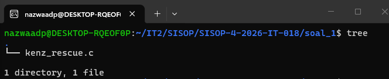

---

#### 2. Compile program dan membuat mount directory

Program dikompilasi menggunakan `gcc` dengan library FUSE. Setelah compile berhasil, muncul executable `kenz_rescue`. Kemudian dibuat folder `mnt` sebagai mount directory.
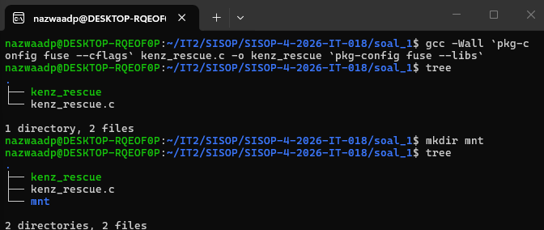

---

#### 3. Download arsip `amba_files.zip`

Arsip catatan Mas Amba diunduh menggunakan `gdown` dan disimpan dengan nama `amba_files.zip`.
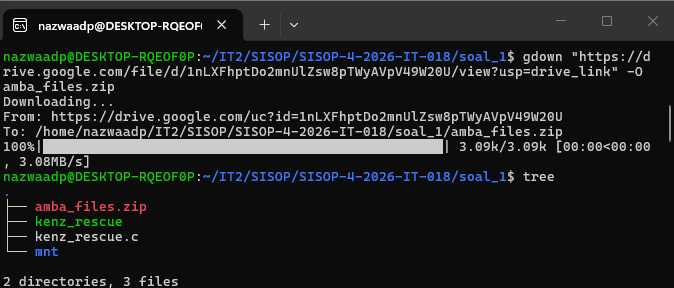

---

#### 4. Unzip arsip dan cek isi `amba_files`

Setelah arsip diekstrak, muncul folder `amba_files/` yang berisi file `1.txt` sampai `7.txt`.
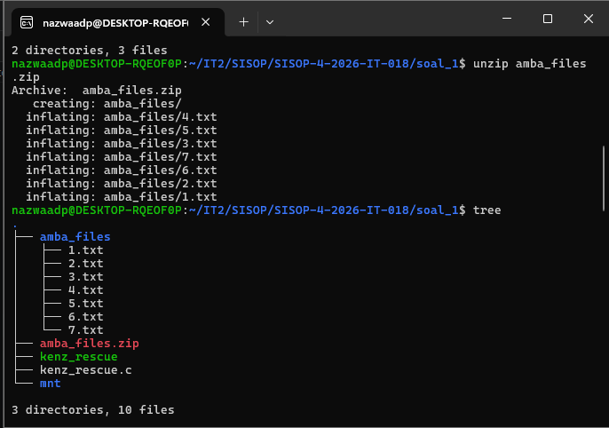

---

#### 5. Menghapus file zip

Setelah proses unzip selesai, file `amba_files.zip` dihapus. Hasil `tree` menunjukkan bahwa file zip sudah tidak ada di working directory.
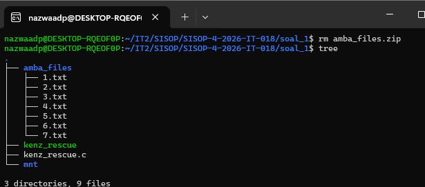

---

#### 6. Menjalankan FUSE

Program dijalankan dengan `amba_files` sebagai source directory dan `mnt` sebagai mount directory.

```bash
./kenz_rescue amba_files -f mnt
```
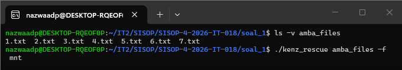

---

#### 7. Isi mount directory

Setelah FUSE berjalan, folder `mnt/` berisi file `1.txt` sampai `7.txt` dan file virtual `tujuan.txt`.
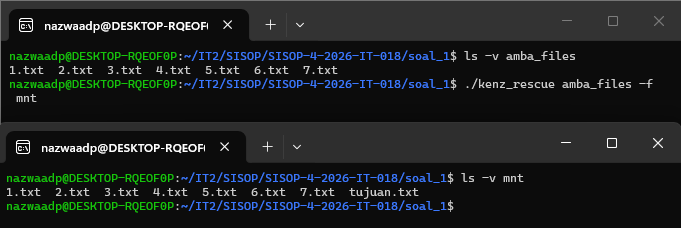

---

#### 8. Passthrough file `1.txt`

Isi `mnt/1.txt` dibandingkan dengan `amba_files/1.txt`. Hasilnya sama, sehingga file pada mount directory berhasil membaca isi dari file asli.
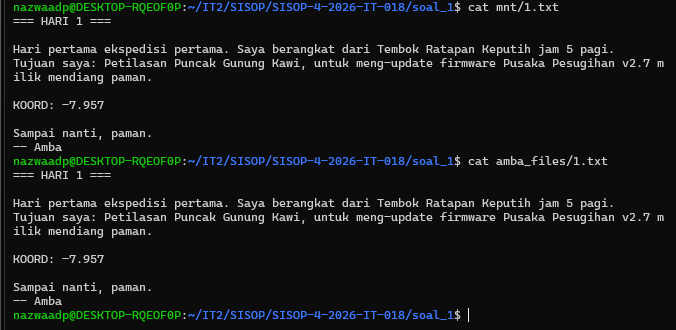

---

#### 9. Pengecekan semua file dengan `diff`

Seluruh file `1.txt` sampai `7.txt` dicek menggunakan `diff`. Semua file menghasilkan output `OK`, sehingga isi file pada mount directory identik dengan source directory.
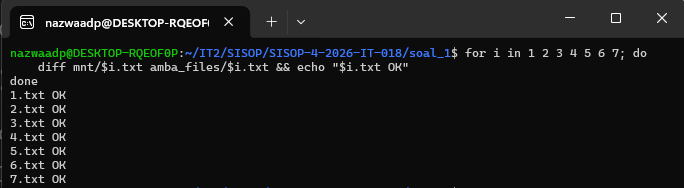

---

#### 10. Fragmen `KOORD:` dari setiap file

Setiap file memiliki baris dengan prefix `KOORD:`. Fragmen-fragmen tersebut digabungkan secara urut untuk menghasilkan isi `tujuan.txt`.
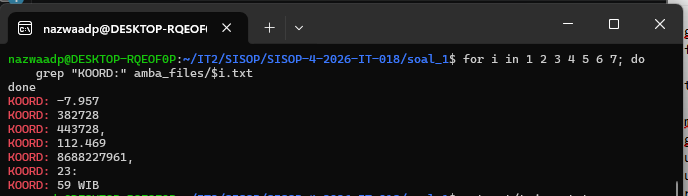

---

#### 11. Isi file virtual `tujuan.txt`

File `tujuan.txt` berhasil menampilkan hasil gabungan fragmen koordinat dari `1.txt` sampai `7.txt`.
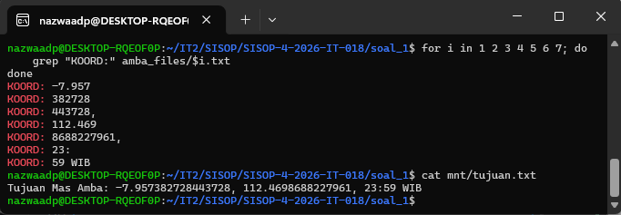

---

#### 12. File `tujuan.txt` tidak ada di source directory

File `tujuan.txt` hanya muncul di mount directory dan tidak ada secara fisik di folder `amba_files/`.
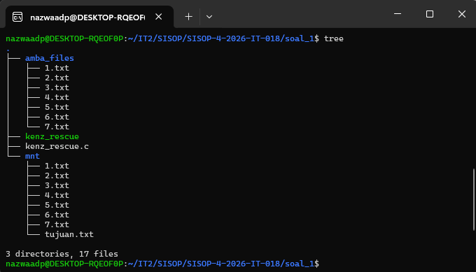

---

## Kendala

Kendala utama adaalh cara memahami cara kerja FUSE, terutama karena file `tujuan.txt` tidak boleh dibuat secara langsung di folder `amba_files/`. File tersebut harus terlihat seperti file biasa dari sisi mount directory, tapi isinya harus dibuat oleh program saat file dibaca.